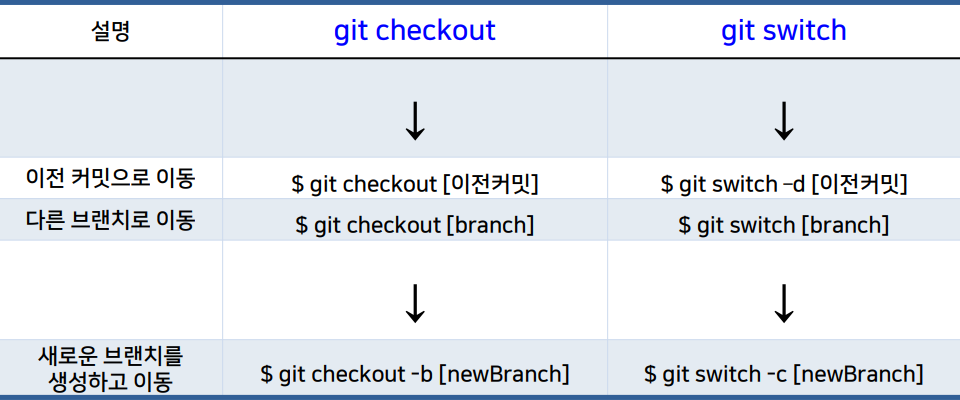

# 07-09 
# 07. 깃 커밋과 로그

## 깃 3 영역
1. 작업 영역 (working directory, working tree) : 탐색기 상의 폴더 하부
2. 스테이징 영역 (staging area, index) : 저장소의 .git 폴더의 파일 index
3. 깃 저장소 (git repository) : 저장소 .git폴더의 여러정보

## add, commit
```
$ git add : 작업 영역 -> 스테이징 영역으로 이동, 복사
$ git commit : 스테이징 영역 -> 깃 저장소로 이동, 복사
```

## 깃 상태 보기
```
$ git status [--long] -> 현재의 상태 표시, 기본 값
$ git status [--short | -s] -> 현재의 상태를 간단히 표시
$ git config --global --edit -> 도움말 보기
```
- 파일 처음 생성(untracked file) -> 붉은 색은 작업 영역
- 처음 add한 파일(a new file) -> 녹색 표시는 스테이징 영역
- 다시 수정한 파일(modified file)-> 스테이징 영역과 비교해서 작업 영역의 파일이 수정됨
- 수정한 파일 add(modigied file) -> 최근 커밋과 비교해서 스테이징 영역의 파일 수정됨
  
## untracked file (처음 만들어진 파일)
- 추적되지 않는 파일 -> 깃에 관리되지 않는 파일을 의미

## add와 unstaging
```
$ git add hello.txt : 작업 영역 -> 스테이징 영역
$ git rm --cached hello.txt : 스테이징 영역의 커밋할 수정 내용에서 삭제 -> 이전 내용으로 수정 -> unstaging
```
## commit
- 현재 스테이징 영역의 내용에 대해 사진 찍기(인덱스에 추가된 파일들의 현재 상태를 저징)
- 커밋 메시지
  ```
  $ git commit -> 커밋 메시지 입력할 기본 편집기 실행
  $ git commit -m 'message' -> 커밋 메시지 입력 [-m | --meddage]
  $ git commit -a -m 'message' -> 추가와 커밋 함께 실행
  $ git commit -am 'message' -> //
  ```
- :warning: untracked file -> 추가와 커밋 동시에 실행 불가능
- 커밋 후 작업 트리는 깨끗한 상태(clean) = 3영역이 동일한 상태

## 커밋 로그 이력
 ```
 $ git log : 로그 이력 정보 표시
 $ git log --oneline :  로그 이력을 한 줄로 표시 -> 커밋 ID 일곱자리, (마지막 커밋 HEAD -> 브랜치 이름) , 커밋 메시지 제목
 $ git log [--patch | -p] : 로그 이력과 파일의 변화(이전 커밋과 현재 커밋 파일의 차이) 표시
 ```
##  커밋 정보
- 특정 커밋 정보를 확인하려면 git show 사용
  ```
  $ git show : 마지막 커밋(가장 최근 커밋)의 정보 표시, 이전 버전과의 파일 차이 diff도 표시
  $ git show --oneline : 커밋 로그 한 줄과 파일 차이 표시
  $ git show -s : 파일 차이는 표시 X
  $ git show[HEAD] : 지정한 HEAD의 커밋 정보 표시
  $ git show[commitID] : 지정한 commitID 의 커밋 정보 표시
  ```
# 08. 로그 이력과 과거 여행
## 로그 옵션

- git log : 가장 최근 커밋부터 표시
- 명령 옵션
  ```
  $ git log --graph -> 문자 그림으로 로그 이력 그리
  $ git log --reverse -> 오래된 커밋부터 표시 --graph와 함께 사용 불가
  $ git log --all -> 모든 브랜치의 로그 이력 표시
  $ git log -n -> 최근 n개의 로그 이력 표시
  ```
## 명령 checkout
- 현재 브랜치에서 과거 커밋 HEAD~로 이동
  ```
  $ git checkout HEAD~ : HEAD 이전 커밋으로 이동
  $ git checkout - : 이전 checkout으로 이동
  $ git checkout main : 브랜치의 마지막 커밋으로 이동
  ```
- git checkout HEAD~
 - 현재 상태가 깨끗해야 checkout 가능
 - 떨어진 HEAD(detached HEAD) 상태
 - 프롬프트 브랜치 이름으로 떨어진 HEAD 상태 표시

</img><br/>

  

