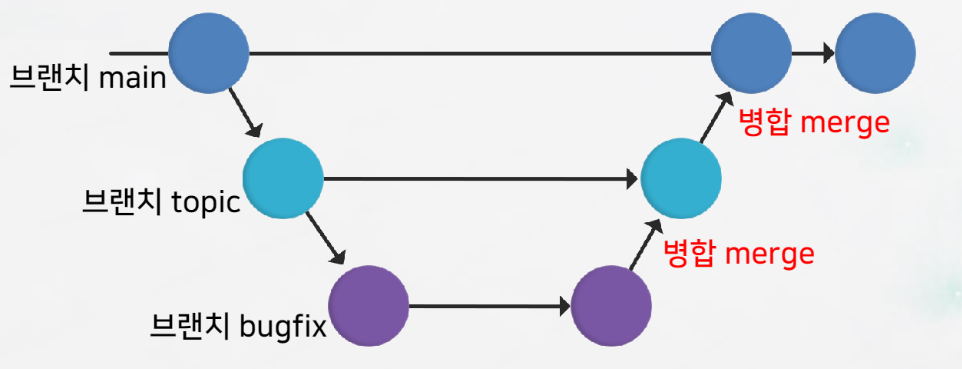

# 13-15
# 13. 버전과 태그 활용

## sw 버전
- 프로그램을 수정, 개선할 때마다 코드 구분을 위해 부여된 식별자
- 보통 숫자 사용
- 년.월 사용하기도 함
  ex) 1.0 , 2.1.4, 2.39.0


## SemVer(Semantic Versioning)방식
-세 자리 숫자 형태로 표기하는 버전
- major.minor.patch
  - major 번호 : 0(초기 개발중), 1~(정식 버전)
  - minor 번호 : 메이저 버전에 기능 추가, 변경 사항있을 때
  - patch 번호 : 미미한 변화(버그 수정)

## 태그(tag)
- 특정 커밋(해시 값)에 버전 번호나 다른 이름을 부여하는 기능
- 태그끼리 이름 중복 X
  1. 주석 태그(Annotated Tag) : 태그 이름 + 정보(태그 작성자 이메일, 태그 시각, 메시지)포함
  2. 일반 태그(Lightweight Tag) : 태그 이름만 포함
  ex) v1.4.0

## 주석 태그 생성
- 주석이 있는 태그
  ```
  $ git tag -a v1.0.0 -m 'first version' -> 작성한 사람의 정보(이메일, 날짜, 메시지) 포함
  $ git tag -a v1.0.0 -> 메시지가 없으면 기본 설정된 편집기로 메시지 편집
    ($ git config --global core.editor 'code --wait')
  $ git tag -a v1.1.0 commitID -> 특정 커밋에 태그 붙임

## 일반 태그 생성
- 태그의 버전 정보만 관리
- -a, -m 사용 불가
  ```
  $ git tag v1.0.1
  ```

## 태그 목록 보기
  ```
  $ git tag -> 예전 태그부터 표시
  ```
## 태그 정보 보이기
  ```
  git show v1.0.0 -> Annotated 태그(주석 태그)의 여러 정보 표시
  ```
## 태그 삭제
  ```
  $ git tag -d v1.0.0 -> 태그만 삭제됨
  ```

# 14. 브랜치 개요와 관리
## 브랜치
- 깃 브랜치 : 버전 관리를 수행하던 일련의 파일 집합을 통째로 복사해 독립적으로 다시 개발을 진행하는 개념
- 하나의 프로젝트를 여러 갈래(Branch : 가지, 지점)로 나누어서 관리
- 브랜치 병합(merge) : 독립된 브랜치를 원래 버전과 합치는 것

## 브랜치와 병합
- 브랜치 병합 : 브랜치와 브랜치를 합치는 수
  
  </img><br/>

## 기본 브랜치
- 저장소 생성 시 처음 만들어지는 브랜치
- main
- 이름 설정 : 기본 설정 명령으로 수정
  ```
  $ git config --global init.defaultBranch main
  ```
- 이미 생성된 저장소의 브랜치 이름 수정
  ```
  $ git config -M newBname(새로운 브랜치 이름)
  ```

## 브랜치와 HEAD
- 커밋 사이를 이동할 수 있는 포인터 -> 브랜치가 많을 때 복잡성을 줄여줌
- HEAD : 작업 중인 브랜치의 최신 커밋을 가리키는 포인터
- 결과 표시(HEAD -> main) : main은 마지막 커밋, HEAD는 현재 작업 브랜치인 main을 가리킴을 의미
- main 브랜치는 자동으로 가장 마지막 커밋을 가리킴

## 새로운 브랜치 생성
- 단순 생성, HEAD 이동 X
  ```
  $ git branch bname
  ```
- 생성 + HEAD 이동 O
  ```
  $ git switch -c bname
  $ git checkout -b bname
  ```
## 브랜치 확인
- 명령 git branch로 현재 저장소의 브랜치 목록을 확인(*이 현재 작업하고 있는 브랜치)
  ```
  $ git branch : 커밋이 발생한 브랜치 목록 보이기
  $ git branch -v : 브랜치마다 마지막 커밋의 ID와 메시지도 표시
  ```
## 생성된 새로운 브랜치로 이동
- HEAD를 지정한 브랜치로 이동
  ```
  $ git switch [bname]
  $ git checkout [bname]
  ```
- HEAD를 이전 브랜치로 이동
  ```
  $ git switch -
  $ git checkout -
  ```
- 분리된(detached HEAD) HEAD : HEAD가 현재 브랜치(마지막 커밋)가 아닌 그 이전 커밋을 가리키는 상태
  ```
  $ git checkout HEAD~ -> 마지막 커밋 전 커밋으로 이동(HEAD~, HEAD^^, commitID사용)

## 브랜치 관리
  ```
